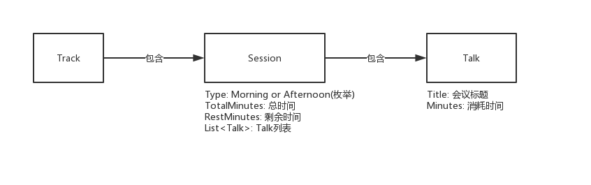

# 会议排期管理


## 题目

最近看到一个ThoughtWork的面试题，这边实现以下，问题如下：

**Problem Two: Conference Track Management**

You are planning a big programming conference and have received many proposals which have passed the initial screen process but you're having trouble fitting them into the time constraints of the day -- there are so many possibilities! So you write a program to do it for you.

- The conference has multiple tracks each of which has a morning and afternoon session.
- Each session contains multiple talks.
- Morning sessions begin at 9am and must finish before 12 noon, for lunch.
- Afternoon sessions begin at 1pm and must finish in time for the networking event.
- The networking event can start no earlier than 4:00 and no later than 5:00.
- No talk title has numbers in it.
- All talk lengths are either in minutes (not hours) or lightning (5 minutes).
- Presenters will be very punctual; there needs to be no gap between sessions.

Note that depending on how you choose to complete this problem, your solution may give a different ordering or combination of talks into tracks. This is acceptable; you don’t need to exactly duplicate the sample output given here.

**Test input:**

```
Writing Fast Tests Against Enterprise Rails 60min
Overdoing it in Python 45min
Lua for the Masses 30min
Ruby Errors from Mismatched Gem Versions 45min
Common Ruby Errors 45min
Rails for Python Developers lightning
Communicating Over Distance 60min
Accounting-Driven Development 45min
Woah 30min
Sit Down and Write 30min
Pair Programming vs Noise 45min
Rails Magic 60min
Ruby on Rails: Why We Should Move On 60min
Clojure Ate Scala (on my project) 45min
Programming in the Boondocks of Seattle 30min
Ruby vs. Clojure for Back-End Development 30min
Ruby on Rails Legacy App Maintenance 60min
A World Without HackerNews 30min
User Interface CSS in Rails Apps 30min
```

**Test output:**

```
Track 1:
09:00AM Writing Fast Tests Against Enterprise Rails 60min
10:00AM Overdoing it in Python 45min
10:45AM Lua for the Masses 30min
11:15AM Ruby Errors from Mismatched Gem Versions 45min
12:00PM Lunch
01:00PM Ruby on Rails: Why We Should Move On 60min
02:00PM Common Ruby Errors 45min
02:45PM Pair Programming vs Noise 45min
03:30PM Programming in the Boondocks of Seattle 30min
04:00PM Ruby vs. Clojure for Back-End Development 30min
04:30PM User Interface CSS in Rails Apps 30min
05:00PM Networking Event

Track 2:
09:00AM Communicating Over Distance 60min
10:00AM Rails Magic 60min
11:00AM Woah 30min
11:30AM Sit Down and Write 30min
12:00PM Lunch
01:00PM Accounting-Driven Development 45min
01:45PM Clojure Ate Scala (on my project) 45min
02:30PM A World Without HackerNews 30min
03:00PM Ruby on Rails Legacy App Maintenance 60min
04:00PM Rails for Python Developers lightning
05:00PM Networking Event
```


## 代码介绍

### 实体类

会议管理系统包含多个实体类

- Track : 负责记录每一天的行程，所有的排期，可以包含多个Track，也就是多天。
- Session : 负责记录每一天上午，或者下午(可以扩展比如晚上)，记录了总共可以分配的时间，剩余可用的时间，开始时间(早上是9点，下午是1点)以及Talk列表。
- Talk : 一次会议，包含的是会议标题，会议耗时。



对于使用者来说，只需要进行一次`new Track()`操作，即可创建出一个包含`上午`和`下午`两个Session的Track，上午可用时间为180分钟，下午可用时间为240分钟，每一个Session生成了一个空的Talk List。

### 枚举类

- SessionType : 定义一个Session，包括Session总共可分配时间以及Session开始时间，使用LocalTime定义时分秒。

### 总流程类

- TrackService : 处理传递过来的Talk列表，分配时间，安排会议，翻译一个Track列表。

### 工具类

- FileUtils : 读取文件每一行，返回一个List<String\>

## 调用流程

1. 读取文件：

```java
List<String> list = FileUtils.read(new File(FileLaction.TEXT_FILE));
if (list == null) {
    throw new RuntimeException("file is null");
}
```

2. 生成Talk列表

```java
TreeSet<Talk> talks = new TreeSet<>(); //使用TreeSet是可以让列表以时间排序
list.forEach(title -> {
    Talk talk = new Talk(title);
    talks.add(talk);
});
```

3. 调用Service

```java
TrackService trackService = TrackService.getInstance(); //TrackService是单例的
List<Track> tracks = trackService.manage(talks);
```

4. 格式化输出

```java
for (int i = 0; i < tracks.size(); i++) {
    Track track = tracks.get(i);
    System.out.println("Track " + (i + 1) + ":");
    System.out.print(track.getMorning().toString());
    System.out.println("12:00PM Lunch");
    System.out.print(track.getAfternoon().toString());
    System.out.println("05:00PM Networking Event");
    System.out.println();
}
```

5. 得到结果

```java
Track 1:
09:00AM Communicating Over Distance 60min
10:00AM Ruby on Rails: Why We Should Move On 60min
11:00AM Writing Fast Tests Against Enterprise Rails 60min
12:00PM Lunch
01:00PM Rails Magic 60min
02:00PM Ruby on Rails Legacy App Maintenance 60min
03:00PM Overdoing it in Python 45min
03:45PM Ruby Errors from Mismatched Gem Versions 45min
04:30PM Programming in the Boondocks of Seattle 30min
05:00PM Networking Event

Track 2:
09:00AM Accounting-Driven Development 45min
09:45AM Pair Programming vs Noise 45min
10:30AM Clojure Ate Scala (on my project) 45min
11:15AM Common Ruby Errors 45min
12:00PM Lunch
01:00PM Woah 30min
01:30PM Ruby vs. Clojure for Back-End Development 30min
02:00PM Sit Down and Write 30min
02:30PM Lua for the Masses 30min
03:00PM User Interface CSS in Rails Apps 30min
03:30PM A World Without HackerNews 30min
04:00PM Rails for Python Developers lightning
05:00PM Networking Event
```

